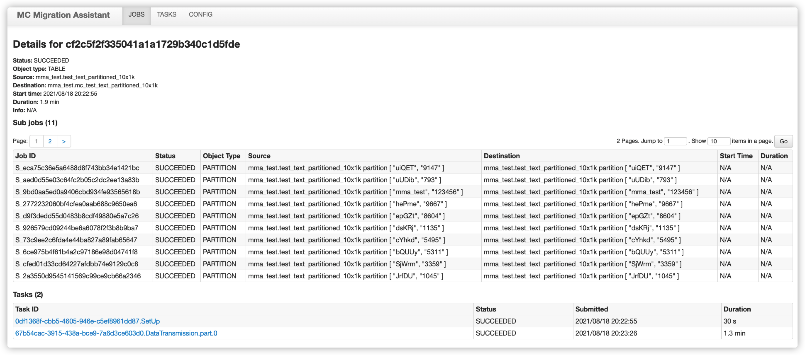
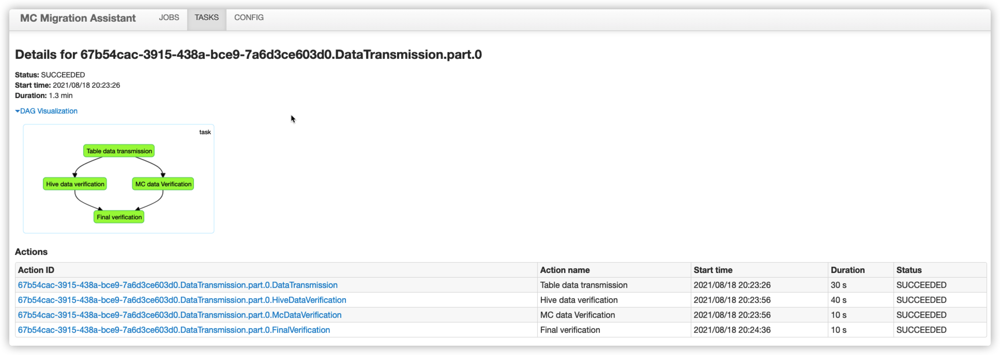
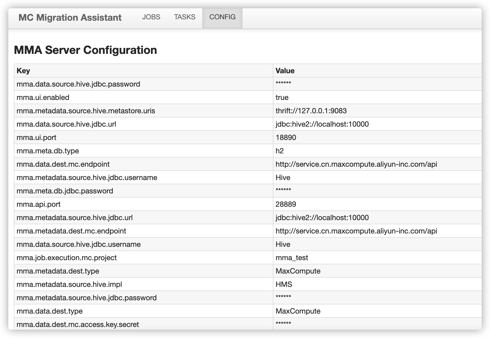

# Hive 迁移至 MaxCompute

在 Hive 迁移至 MaxCompute 的场景下，MMA 实现了 Hive 的 UDTF，通过 Hive 的分布式能力，实现 Hive 数据向 MaxCompute 的高并发传输。

这种迁移方式的优点有：
- 读数据由 Hive 自身完成，因此可以被 Hive 读的数据（包括 Hive 外表），都可以用 MMA 向 MaxCompute 迁移，且不存在任何数据格式问题
- 支持增量数据迁移
- 迁移效率高，迁移速率可以随资源分配线性提高

这种迁移方式的前置条件有：
- Hive 集群各节点需要具备访问 MaxCompute 的能力

## <a name="Architecture"></a>架构与原理
当用户通过 MMA client 向 MMA server 提交一个迁移 Job 后，MMA 首先会将该 Job 的配置记录在元数据中，并初始化其状态为 PENDING。

随后，MMA 调度器将会把这个 Job 状态置为 RUNNING，向 Hive 请求这张表的元数据，并开始调度执行。这个 Job 在 MMA 中会被拆分为若干
个 Task，每一个 Task 负责表中的一部分数据。每一个 Task 将会包含如下图所示的，由若干个 Action 组成的 DAG：

```$xslt
            CreateTable (在 MC 中创建表)
                 |
            AddPartition (在 MC 中添加分区，仅限分区表)
                 |
            DataTransfer (数据传输)
         +-------+-------+
         |               |
Source Verification   Dest Verification
         |               |
         +-------+-------+
                 |
      Compare Verification Result (对比验证结果)
```

上图中数据传输的原理是利用 Hive 的分布式计算能力，实现了一个 Hive UDTF，在 Hive UDTF 中实现了上传数据至 MaxCompute 的逻辑，并将一个数据迁移任务转化为一个或多个形如：

```sql
SELECT UDTF(*) FROM hive_db.hive_table;
```
的 Hive SQL。在执行上述 Hive SQL 时，数据将被 Hive 读出并传入 UDTF，UDTF 会通过 MaxCompute 的 Tunnel SDK 将数据写入 MaxCompute。

当某一个 Task 的所有 Action 执行成功后，MMA 会将这个 Task 负责的部分数据的迁移状态置为 SUCCEEDED。当该 Job 对应的所有 Task 都成功
后，这张表的迁移结束。

当某一个 Task 的某一个 Action 执行失败，MMA 会将这个 Task 负责的部分数据的迁移状态置为 FAILED，并生成另一个 Task 负责这部分数据，
直到成功或达到重试次数上限。

当表中数据发生变化时（新增数据，新增分区，或已有分区数据变化），可以重新提交迁移任务，此时 MMA 会重新扫描 Hive 中元数据，
发现数据变化，并迁移发生变化的表或分区。

## <a name="Preparation"></a>准备工作
### 1. 确认 Hive 版本
在 Hadoop 集群的 master 节点执行 ```hive --version``` 确认 Hive 版本，根据返回下载对应 MMA 安装包。

例如：
```console
$ hive --version
Hive 1.0.0
```

此时应选择 Github release 页面下，mma-hive-1.x-release.tar.gz。


### 2. 确认 Hive 集群各个节点具备访问 MaxCompute 的能力

首先确认 MaxCompute endpoint，官方参考文档：https://help.aliyun.com/document_detail/34951.html

根据阿里云各 Region 的部署及网络情况，您可以通过以下三种连接方式访问 MaxCompute 服务和 Tunnel 服务：
- 从外网访问 MaxCompute 服务和 Tunnel 服务
- 从阿里云经典网络访问 MaxCompute 服务和 Tunnel 服务
- 从阿里云 VPC 网络访问 MaxCompute 服务和 Tunnel 服务

以上三种连接方式使用的 MaxCompute endpoint 有所区别，对于在 Aliyun 上搭建的 Hive 集群，或到 Aliyun 有专线的 Hive 集群，见上面文档中 VPC 网络下 Region 和服务连接对照表。对于其他情况，见外网网络下地域和服务连接对照表。

确认 MaxCompute endpoint 后，可以在 Hive 集群各个节点分别执行 ```curl "MaxCompute endpoint"```，如果命令立刻返回，
说明可以访问 MaxCompute。

例如：

```console
$ curl http://service.cn-hangzhou.maxcompute.aliyun-inc.com/api
<?xml version="1.0" encoding="UTF-8"?>
<Error>
	<Code>NoSuchObject</Code>
	<Message><![CDATA[Unknown http request location: /]]></Message>
	<RequestId>5E748282CA7BCB32D7651D20</RequestId>
	<HostId>localhost</HostId>
</Error>
```

即表示该节点可以访问 MaxCompute。

### <a name="MCConfigure"></a>3. MaxCompute 配置

使用 MMA 前，需要确认 MaxCompute project 已经按照[文档](https://help.aliyun.com/document_detail/159541.html?spm=a2c4g.11186623.6.639.7336134dNbODrx)配置了 2.0 数据类型版本

## <a name="Configuration"></a>配置

目录结构

```
MMA_HOME
└── conf
    ├── gss-jaas.conf.template					
    ├── mma_server_config.json					
    └── table_mapping.txt							
```

mma 的配置文件一般不手动修改，使用工具进行管理，主要包括 mma server 的配置（见 [配置 MMA server](#Configure)）与 任务配置（见 [生成任务配置](#GenerateJobConfig)）

### <a name="Configure"></a>配置 MMA server

首先解压 MMA 安装包。之后执行以下命令，运行配置引导脚本，完成配置：

```$xslt
/path/to/mma/bin/configure
```

配置过程中需要提供以下 Hive 参数：

| 参数名                | 含义                                                        | 示例                                |
| :-------------------- | :---------------------------------------------------------- | :---------------------------------- |
| Hive metastore URI(s) | 见 hive-site.xml 中"hive.metastore.uris"                      | thrift://hostname:9083              |
| Hive JDBC 连接串       | 通过 beeline 使用 Hive 时输入的 JDBC 连接串, 前缀为 jdbc:hive2     | jdbc:hive2://hostname:10000/default |
| Hive JDBC 连接用户名   | 通常通过 beeline 使用 Hive 时输入的 JDBC 连接用户名, 默认值为 Hive | Hive                                |
| Hive JDBC 连接密码     | 通常通过 beeline 使用 Hive 时输入的 JDBC 连接密码, 默认值为空     |                                     |

在使用 Kerberos 的情况下，配置过程需要提供以下 Hive Security 参数

| 参数名                   | 含义                                                      | 示例                   |
| ------------------------ | --------------------------------------------------------- | ---------------------- |
| jams-gss.conf 文件路径   | 查看文档和 conf/gss-jaas.conf.template                    |                        |
| krb5.conf 文件路径       | 通常在 /etc 目录下                                        |                        |
| Kerberos principal 属性  | 见 hive-site.xml 中 "hive.metastore.kerberos.principal"   | hive/_HOST@EXAMPLE.com |
| Kerberos keytab 文件路径 | 见 hive-site-xml 中 "hive.metastore.kerberos.keytab.file" |                        |

配置过程中需要提供以下 MaxCompute 参数：

| 参数名                 | 含义                                                     | 示例                                                 |
| :--------------------- | :------------------------------------------------------- | :--------------------------------------------------- |
| MaxCompute endpoint    | 上文中获取的 MaxCompute endpoint                          | http://service.cn-hangzhou.maxcompute.aliyun.com/api |
| MaxCompute project 名   | 建议配置为目标 MaxCompute project, 规避权限问题           |                                                      |
| 阿里云 accesskey id     | 详见: https://help.aliyun.com/document_detail/27803.html |                                                      |
| 阿里云 accesskey secret | 详见: https://help.aliyun.com/document_detail/27803.html |                                                      |

### <a name="createHiveFunction"></a>创建 Hive 函数

此外，配置过程中还需要将某些文件上传至 HDFS，并在 beeline 中创建 MMA 需要的 Hive 永久函数。MMA 配置引导脚本会自动生成需要执行的命令，直接复制粘贴到安装有 hdfs 命令与 beeline 的服务器上执行即可。命令示例如下：


上传 Hive UDTF Jar 包至 HDFS：

```shell
hdfs dfs -put -f ${MMA_HOME}/lib/data-transfer-hive-udtf-${MMA_VERSION}-jar-with-dependencies.jar hdfs:///tmp/
```

使用 beeline 创建 Hive 函数：

```sql
DROP FUNCTION IF EXISTS default.odps_data_dump_multi;
CREATE FUNCTION default.odps_data_dump_multi as 'com.aliyun.odps.mma.io.McDataTransmissionUDTF' USING JAR 'hdfs:///tmp/data-transfer-hive-udtf-${MMA_VERSION}-jar-with-dependencies.jar';
```

### 进度推送

MMA 支持向钉钉群推送进度信息。目前支持任务（Job）级别的 状态总结（SUMMARY），迁移成功（SUCCESS）以及迁移失败（FAIL）三种类型的事件。

- 准备：使用本功能前需要创建一个钉钉群，并获取钉钉群自定义机器人的 webhook url，方法可以参考[文档](https://ding-doc.dingtalk.com/document#/isv-dev-guide/custom-robot-development)。

- 配置：在 `conf/mma_server_config.json` 文件中添加以下配置，用真实的 webhook url 替换 `${webhookurl}`，并重启 MMA server。

  `mma.event.types` 可以配置`JOB_SUCCEEDED`，`JOB_FAILED`，以及`SUMMARY` 三种，大小写敏感。需要配置多个多个类型的情况下使用英文逗号 `,` 分割，如 `JOB_SUCCEEDED,JOB_FAILED`

  ```json
  {
    "mma.event.enabled": "true",
    "mma.event.senders": "[{\"type\": \"DingTalk\",\"webhookUrl\": ${webhookurl}]",
    "mma.event.types": "SUMMARY"
  }
  ```


## 最佳实践

### 存量数据迁移
在存量数据迁移的场景下，我们可以通过以下步骤完成数据迁移：
1. 确认待迁移的表：由于开发和生产过程中，会产生很多已经废弃不用的表或忘记清理的临时表。这些表往往不再具有价值，因此无需进行迁移。忽略这些表会大大节省数据迁移过程中的时间/计算资源开销，同时也是一次很好的业务梳理机会。
1. 启动 MmaServer，见[启动 MMA server](#StartMmaServer)
1. 生成迁移任务配置文件，见[生成任务配置](#GenerateJobConfig)
1. 提交迁移任务，见[提交迁移任务](#SubmitJob)
1. 反复执行 1, 2, 3 三步，通过 MMA client 向 MMA server 提交所有待迁移表
1. 等待迁移任务完成（可以另开一个 terminal 追踪进度，与 1, 2, 3 步不冲突），见[查看迁移任务列表](#ListJobs)
1. 处理失败的任务并重启任务，见[查看迁移任务列表](#ListJobs)与[失败处理](#HandleFailures)

### 增量数据迁移
当存量数据通过 MMA 进行迁移之后，MMA 支持对新增分区或最近被修改的分区进行增量数据进行迁移。当您确认新增的分区已经处于可迁移的状态（不会有新数据进入该分区），可以通过直接重新提交迁移任务，让 MMA 获取新增的分区，并进行迁移。迁移步骤如下：
1. 完成存量数据迁移
1. 确认源表不再有修改，可以迁移
1. 重置迁移任务，此时 MMA 会自动发现新分区和有修改的分区并进行迁移，见[重置迁移任务](#ResetJob)
1. 等待迁移任务完成，见[查看迁移任务列表](#ListJobs)
1. 处理失败的任务并重启任务，见[查看迁移任务列表](#ListJobs)与[失败处理](#HandleFailures)

## MMA 命令行工具

MMA 命令行工具位于 `$MMA_HOME/bin/` 目录下，包括 `mma_server` / `configure` / `generate-job-config` / `mma_client` 四个工具

```shell
MMA_HOME
└── bin
    ├── configure								# 生成 mma server 配置的工具
    ├── generate-job-config			# 生成任务配置的工具
    ├── mma-client							# 客户端命令行工具
    └── mma-server							# 服务端命令行工具
```

### <a name="StartMmaServer"></a>启动 MMA server

执行以下命令启动 MMA server，MMA server 进程在迁移期间应当一直保持运行。若 MMA server 因为各种原因中断了运行，直接执行以上命令重启即可。MMA server 进程在一台服务器最多只能存在一个。默认端口为 18889

```shell
/path/to/mma/bin/mma-server
```

### <a name="GenerateJobConfig"></a>生成任务配置

使用 `bin/generate-job-config` 工具生成任务配置

- 表级别任务配置

  //TODO 添加 generate-job-config 脚本

  - 首先组织临时文件 table_mapping.txt，`conf/table_mapping.txt` 文件提供了编写模版（其中每一行表示一张 Hive 表到 MaxCompute 表的映射）：

    ```$xslt
    # The following example represents a migration job. The source table is 'source_table' in Hive
    # database 'source_db' and the destination table is 'dest_table' in MaxCompute project 'dest_pjt'
    
    test_db.test_table:test_project.test_table
    test_db_2.test_table:test_project_2.test_table
    test_db.test_table_2:test_project_2.test_table_2
    ```
  - 之后执行以下命令直接生成 table_mapping.txt 文件中包含的迁移任务配置。
    ```shell
    /path/to/mma/bin/generate-job-config --type TABLE
    ```
    执行完成后，当前目录下将会生成 MMA 迁移任务的配置文件 mma_migration_config.json。

- 库级别任务配置

  - 执行以下命令生成迁移任务配置。过程中需要配置 `job_id` `source_catalog_name` `dest_catalog_name`

    ```shell
    /path/to/mma/bin/generate-job-config --type CATELOG
    ```

### 任务管理

使用 `bin/mma-client` 工具进行任务的增删改查管理。

#### <a name="SubmitJob"></a>提交任务

执行以下命令，向 MMA server 提交迁移任务（`mma_migration_config.json` 的生成见上一小节[生成任务配置](#GenerateJobConfig)）：
```console
$ /path/to/mma/bin/mma-client --action SubmitJob --conf mma_migration_config.json
Submitting job, this may take a few minutes
OK
```
任务提交成功时，MMA client 会打印 ```Job submitted``` 并结束进程，返回值为 0：

#### <a name="GetJobInfo"></a>查看任务状态

```console
$ /path/to/mma/bin/mma-client --action GetJobInfo --jobid YOUR_JOB_ID
Job ID: cat2
Job status: SUCCEEDED
Object type: CATALOG
Source: test_catalog
Destination: mma_test
OK
```


#### <a name="ListJobs"></a>查看迁移任务列表
执行以下命令，查看所有迁移任务列表（列表会列出所有任务的状态与进度）：
```console
$ /path/to/mma/bin/mma-client --action ListJobs
Job ID: 2263e913e9ba4130ac1e930b909dafab, status: FAILED, progress: 0.00%
Job ID: cf2c5f2f335041a1a1729b340c1d5fde, status: SUCCEEDED, progress: 0.00%
OK
```
MMA 支持通过 WebUI 查看目前正在运行的迁移任务，见 [Web UI](#WebUI)

#### <a name="RemoveJob"></a>删除迁移任务

执行以下命令，可以删除状态为 SUCCEEDED 或 FAILED 的迁移任务。
```console
$ /path/to/mma/bin/mma-client --action DeleteJob --jobid YOUR_JOB_ID
OK
```

#### <a name="ResetJob"></a>重置迁移任务

- 状态为 `SUCCESS` `FAIL` `CANCEL` 三种状态下的任务可以被重置
- 当需要增量同步时，重置 `SUCCESS` 状态下的任务
- 当需要重试失败任务时，重置 `FAIL` `CANCEL` 状态下的任务

```console
$ /path/to/mma/bin/mma-client --action ResetJob --jobid YOUR_JOB_ID
Resetting job, this may take a few minutes
OK
```

#### mma-client 其他参数说明

```console
$ ./bin/mma-client -h
usage: mma-client --action [SubmitJob | ResetJob | ListJobs | GetJobInfo |
                  StopJob | DeleteJob] [options]
 -a,--action <Action>          Could be 'SubmitJob', 'ResetJob',
                               'ListJobs', 'GetJobInfo', 'StopJob', and
                               'DeleteJob'
 -c,--config <Job conf path>   Required by action 'Submit'
 -h,--help                     Print usage
    --host <Hostname>          Hostname of MMA server
 -jid,--jobid <Job ID>         Required by action 'GetJobInfo',
                               'ResetJob', 'StopJob', and 'DeleteJob'
    --port <Port>              Port of MMA server
```

## <a name="WebUI"></a>MMA Web UI
为了带给用户更好的体验，MMA 支持了 Web UI。目前 Web UI 主要用于查看任务的状态，进度，以及有助于错误排查的各种 debug 信息。

Web UI 运行在 MMA server 所在服务器的 18888 端口，可以通过 `http://${hostname}:18888` 地址进行访问。

当前 Web UI 的功能主要包括 Job / Task / Action 的状态查看与 MMA Server 配置信息查看

### 查看 Job 信息

查看所有 Job 的信息与状态


点击 Job ID 进入 Job 详情界面，可以查看所有的 sub job 与 task 细节



### 查看 Task 信息

在 TASKS 界面可以查看所有的 Task 信息


点击 Task ID 可以查看 Task 的详情页，包括 Action 的有向无环图与 Action 细节



点击 Action ID 可以继续查看 Action 的执行细节


### 查看 MMA Server 配置信息




## <a name="HandleFailures"></a>失败处理
由于 MMA 会自动归档日志，以下```grep```命令请根据实际情况替换为```zgrep```命令。

一般的失败处理过程为：

- 查找导致失败的具体 Action
  - 获取失败任务 Job ID
  - 获取任务失败原因（对应 Task ID）
  - 根据 Task ID 获取失败 Action
- 查看文档中各种 Action 可能的失败原因及调查方法。

接下来我们对失败处理过程进行具体介绍：

### 查找导致失败的具体 Action


执行以下命令查看当前迁移失败的 Job，获取 Job ID：
```console
$ path/to/mma/bin/mma-client --action ListJobs | grep FAILED
Job ID: 2263e913e9ba4130ac1e930b909dafab, status: FAILED, progress: 0.00%
OK
```

获得 Job ID 后可以执行以下命令获取失败的原因：

```console
$ grep "Job failed" /path/to/mma/log/mma_server.LOG* | grep 2263e913e9ba4130ac1e930b909dafab
2021-08-19 13:50:54,141 INFO  [main] job.AbstractJob (AbstractJob.java:fail(310)) - Job failed, id:
2263e913e9ba4130ac1e930b909dafab, reason: com.aliyun.odps.mma.server.task.HiveToMcTableDataTransmiss
ionTask failed, id(s): 492ef03d-d0e8-4cb3-afc4-6f540c2f420a.DataTransmission.part.0
```

通过以上日志，我们可以看到 Job 失败的原因是 `HiveToMcTableDataTransmissionTask` 的失败。通过这个 Task ID 可以进一步查看具体失败的 Action：

```console
$ grep 492ef03d-d0e8-4cb3-afc4-6f540c2f420a.DataTransmission.part.0 log/mma_server.LOG* | grep FAIL
2021-08-19 13:50:49,594 INFO  [main] action.AbstractAction (AbstractAction.java:setProgress(163)) - 
Set action status, id: 492ef03d-d0e8-4cb3-afc4-6f540c2f420a.DataTransmission.part.0.DataTransmission, 
from: RUNNING, to: FAILED
```

输出中会包含失败的 Action 信息，我们需要的是最后一条 Set action status 信息。综合以上信息，我们得出结论：是 `HiveToMcTableDataTransmissionTask` 中的 `DataTransmission` Action（Action ID = Task ID + Action Name） 导致任务失败。

接下来，我们将介绍各种 Action 可能的失败原因，以及调查方法。

### Action 失败原因参考

#### CreateTable

这个 Action 失败通常因为 MaxCompute 中没有打开新类型开关，请参考准备工作中的 [MaxCompute 配置](#MCConfigure)一节。

调查方法：

根据 Action ID 在 mma/log/task_runner.LOG 中查找 DDL 在 MC 中执行的 logview：

```console
$ grep "${ACTION_ID}" /path/to/mma/log/action_executor.LOG
2020-10-26 18:03:47,658 [ActionExecutor- #17] ActionId: 0df1368f-cbb5-4605-946e-c5ef8961dd87.SetUp.CreateTable, 
InstanceId: 20201026100347413gvsu46pr2
2020-10-26 18:03:47,695 [ActionExecutor- #17] ActionId: 0df1368f-cbb5-4605-946e-c5ef8961dd87.SetUp.CreateTable, 
LogView http://logview.odps.aliyun.com/logview/?h=http://service.cn.maxcompute.aliyun-inc.com/api&p=odps_mma_test&i=20201026100347413gvsu46pr2&token=SC83c2JOODVtWG9XT3BKSWxPZTNoNVdYM0R3PSxPRFBTX09CTzoxNTU4MzkxOTQ2NTYxODIxLDE2MDM5NjU4MjcseyJTdGF0ZW1lbnQiOlt7IkFjdGlvbiI6WyJvZHBzOlJlYWQiXSwiRWZmZWN0IjoiQWxsb3ciLCJSZXNvdXJjZSI6WyJhY3M6b2RwczoqOnByb2plY3RzL29kcHNfbW1hX3Rlc3QvaW5zdGFuY2VzLzIwMjAxMDI2MTAwMzQ3NDEzZ3ZzdTQ2cHIyIl19XSwiVmVyc2lvbiI6IjEifQ==
```
此时可以将在浏览器中打开 logview URL，即可看到具体失败原因。

#### AddPartitions
这个 Action 可能因为元数据并发操作太多导致失败，在绝大多数情况下可以靠 MMA 自动重试解决，用户无需介入。

调查方法同 [CreateTable](#CreateTable)。

#### DataTransmission
这个 Action 可能的失败情况比较多，常见的如下：
1. Hive UDTF 没有正确创建，请参考请参考配置中[创建 UDTF 部分](#createHiveFunction)
1. 集群网络环境问题，MapReduce 任务报错如 UnknownHost（DNS 问题），或 Connection Timeout（Endpoint 配置或路由问题）
1. string 超过 8MB，这个问题请提交工单解决
1. 脏数据，此时这张表或分区往往已经无法正常读出数据
1. 并发数量高，压力大导致失败，由于 MMA 自动重试机制，这个问题目前很少出现

调查方法：

首先，根据 Action ID 在 mma/log/mma_server.LOG 中查找报错：

```console
$ grep "${ACTION_ID}" /path/to/mma/log/mma_server.LOG* | grep "stack trace"
log/mma_server.LOG:2021-08-19 13:52:54,719 ERROR [main] action.AbstractAction (AbstractAction.java:afterExecution(138)) - 
Action failed, actionId: f8a5952b-a634-4e16-a77c-8d47e58173f2.DataTransmission.part.0.DataTransmission, 
stack trace: java.util.concurrent.ExecutionException: org.apache.hive.service.cli.HiveSQLException: 
Error while compiling statement: FAILED: SemanticException Line 0:-1 Invalid function 'default.odps_data_dump_multi'
```
输出中会包含失败原因，以上的输出信息告诉我们 Action 失败是因为 Hive UDTF 没有正确创建。

如果失败原因为 MapReduce Job 执行失败，则需要查找 MapReduce Job 失败原因。根据 Action ID 在 mma/log/action_executor.LOG 中
查找 Hive SQL 的 tracking URL。命令为

```console
$ grep "${ACTION_ID}" /path/to/mma/log/action_executor.LOG
2020-10-26 16:38:20,116 [Thread-12] ActionId: 0df1368f-cbb5-4605-946e-c5ef8961dd87.DataTransmission.part.1.DataTransmission, 
jobId:  job_1591948285564_0267
2020-10-26 16:38:20,116 [Thread-12] ActionId: 0df1368f-cbb5-4605-946e-c5ef8961dd87.DataTransmission.part.1.DataTransmission, 
tracking url:  http://emr-header-1.cluster-177129:20888/proxy/application_1591948285564_0267/
```
根据上面的信息，可以在 yarn 上查找这个 MapReduce Job 的日志。

#### HiveDataVerification
这个 Action 失败通常与 Hive 集群相关。

调查方法：

根据 Action ID 在 mma/log/action_executor.LOG 中查找 Hive SQL 的 tracking URL：

```console
$ grep "${ACTION_ID}" /path/to/mma/log/action_executor.LOG
2020-10-26 16:38:20,116 [Thread-12] ActionId: 0df1368f-cbb5-4605-946e-c5ef8961dd87.DataTransmission.part.1.HiveDataVerification, 
jobId:  job_1591948285564_0267
2020-10-26 16:38:20,116 [Thread-12] ActionId: 0df1368f-cbb5-4605-946e-c5ef8961dd87.DataTransmission.part.1.HiveDataVerification, 
tracking url:  http://emr-header-1.cluster-177129:20888/proxy/application_1591948285564_0267/
```
#### McDataVerification
这个 Action 失败通常与 MC 相关。

调查方法：

根据 Action ID 在 mma/log/action_executor.LOG 中查找 DDL 在 MC 中执行的 logview：

```console
$ grep "${ACTION_ID}" /path/to/mma/log/action_executor.LOG
2020-10-26 18:03:47,658 [ActionExecutor- #17] ActionId: 0df1368f-cbb5-4605-946e-c5ef8961dd87.DataTransmission.part.1.McDataVerification, 
InstanceId: 20201026100347413gvsu46pr2
2020-10-26 18:03:47,695 [ActionExecutor- #17] ActionId: 0df1368f-cbb5-4605-946e-c5ef8961dd87.DataTransmission.part.1.McDataVerification, 
LogView http://logview.odps.aliyun.com/logview/?h=http://service.cn.maxcompute.aliyun-inc.com/api&p=odps_mma_test&i=20201026100347413gvsu46pr2&token=SC83c2JOODVtWG9XT3BKSWxPZTNoNVdYM0R3PSxPRFBTX09CTzoxNTU4MzkxOTQ2NTYxODIxLDE2MDM5NjU4MjcseyJTdGF0ZW1lbnQiOlt7IkFjdGlvbiI6WyJvZHBzOlJlYWQiXSwiRWZmZWN0IjoiQWxsb3ciLCJSZXNvdXJjZSI6WyJhY3M6b2RwczoqOnByb2plY3RzL29kcHNfbW1hX3Rlc3QvaW5zdGFuY2VzLzIwMjAxMDI2MTAwMzQ3NDEzZ3ZzdTQ2cHIyIl19XSwiVmVyc2lvbiI6IjEifQ==
```
此时可以将在浏览器中打开 logview URL，即可看到具体失败原因。

#### FinalVerification
这个 Action 失败通常因为 MC 和 Hive 中数据不一致，MMA 的重试机制通常可以自动解决这个问题。

调查方法：

根据 Action ID 在 mma/log/mma_server.LOG 中查找日志：

```console
$ grep "${ACTION_ID}" /path/to/mma/log/mma_server.LOG
2020-10-27 14:56:37,781 ERROR [Scheduler] action.AbstractAction (VerificationAction.java:call(77)) - 
ActionId: 0df1368f-cbb5-4605-946e-c5ef8961dd87.DataTransmission.part.1.FinalVerification, verification failed, source: 1, dest: 2
```
## FAQ
## 1. 升级 MMA
MMA 会不断更新功能，并修复已知问题，提高稳定性，因此我们建议长期使用 MMA 的客户升级 MMA。升级 MMA 的步骤如下：
1. 下载解压新版本 MMA
1. 停止老版本 MMA
1. 将已有的 MMA 根目录下的元数据文件.MmaMeta.mv.db 复制到新版本 MMA 的根目录下
1. 启动新版本 MMA

## 2. 迁移速率慢
可能的原因包括：
- 公共云限流：最大允许的带宽为 2Gbps，如果需要调整限流阈值请提工单
- Endpoint 配置：注意区分公网和阿里云内网 Endpoint

## 3. 导入到多个 MC project
需要保证在执行 mma/bin/configure 的时候，填入的阿里云账号有这些 project 的 admin 权限。之后在配置 table mapping 时就可以
选择将数据导入不同 project 了。请参考[生成任务配置](#GenerateJobConfig)

## 4. 进度条一直不动
目前进度条是基于完成的分区数量显示进度的，因此会出现跳变的情况（对于非分区表会直接从 0 跳到 100）。这一点将在后续版本优化，
目前可以通过 ```tailf mma/log/mma_server.LOG``` 来监控。
